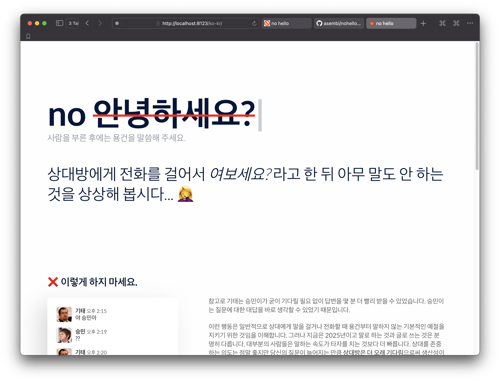

# 안녕하세요 금지!

.

my forked site here > https://sembee.kr/nohello-net-KR/   

original site > https://nohello.net/



[nohello](https://nohello.net/)의 한국어 번역을 작업하여 추가하였습니다

좀 더 일상 및 업무에서 사용할 법한 표현을 의미가 전달되게 표현하고자 의역을 좀 많이 넣었습니다

`lang/ko-KR` 브랜치로 PR예정입니다

`site` 브랜치에서 페이지 deploy했습니다

타이틀 애니메이션으로 인한 텍스트 줄바꿈 때문에 작은 화면에서 스크롤이 자꾸 늘어났다 줄어드는 현상이 생겨 그냥 화면 밖으로 벗어나면 잘리게 설정했습니다

협업도 해본 적 없고, PR은 완전 처음이라 어떻게 다뤄야 원본 개발자가 편할지 모르겠습니다

korean language added on `lang/ko-KR` branch

github page deployed on `site` branch

I took some liberties with the translation to make it give more k-vibes

I fixed shitty text-wrap scroll issue just add some no-wrap options on `style.css`

First time doing a PR — let me know if I messed anything up or can clean it up

.

.

.

---


# No Hello

Hello!

https://nohello.net/

## Translators

We've added language support to the site, but are still working out the best workflow for people to submit translations. (There's a small amount of manual work required on the code side!)

If you'd like to submit a translation, you can find us on [Transifex](https://www.transifex.com/nohello/nohellodotnet/). I _think_ you can suggest translations directly on their site without needing an invite to the organisation, but I'm not sure exactly. Let us know! Let's figure it out.

Either way, open an issue on our GitHub repo, and we'll work out the best way to proceed :)

## Programmers

This project is a [Eleventy](https://www.11ty.dev/) site. If you've used a static site generator before, you're pretty much good to go. If not, take a look through the [Eleventy documentation](https://www.11ty.dev/docs/) to get up to speed.

### Getting Started

It's a JavaScript site, so you'll need `node` installed. Using [nvm](https://github.com/nvm-sh/nvm) will make sure you're using the right version.

```sh
# git clone, etc
yarn        # install dependencies
yarn serve  # run development server
```

Then open [localhost:8123](http://localhost:8123/) in your browser, and you should be ready to disco.

### Making Changes

Unit tests are via Mocha. Nothing too fancy there.

We use UI tests via [Playwright](https://playwright.dev/). To ensure consistency, the snapshots are taken with a Linux container. To run this locally for convenience, you'll need two things installed: [Docker](https://docs.docker.com/desktop/mac/install/) and [act](https://github.com/nektos/act).

Available commands:

```sh
yarn check-snapshots  # do your snapshots match?
yarn update-snapshots # if not, update your snapshots!
```

### Translations

- we use [Transifex](https://www.transifex.com/)
- we use [Transifex CLI](https://github.com/transifex/cli/releases) (currently no `brew` package!)
- the base language is English

Changed base strings? `yarn strings:push`. Updated translations? `yarn strings:pull`.
